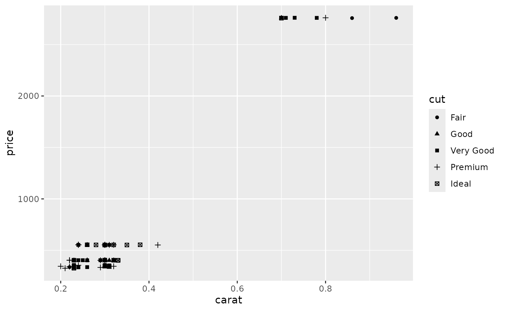
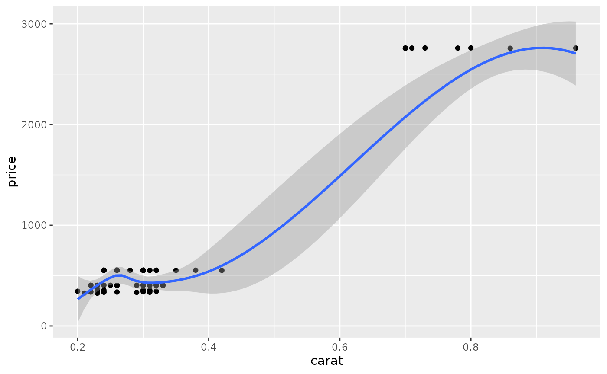
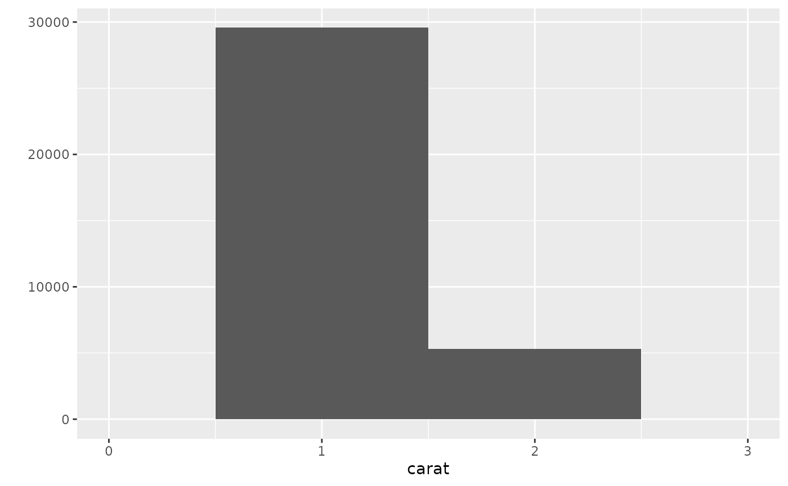
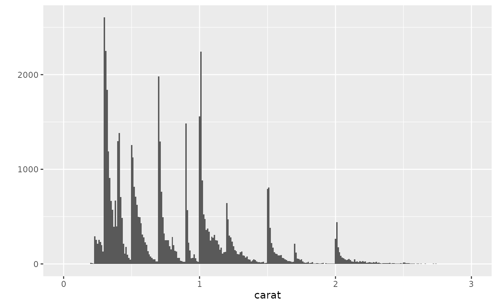

# Testing the VI.ggplot() within the BrailleR package"

This vignette contained many more plots in its initial development. The
set has been cut back considerably to offer meaningful testing only, and
because much of the material was moved over to a book called [BrailleR
in Action](https://R-Resources.massey.ac.nz/BrailleRInAction/). Doing so
also had an advantage of speeding up the package creation, testing, and
installation. N.B. the commands here are either exact copies of the
commands presented in Wickham (2009) or some minor alterations to them.
Notably, some code given in the book no longer works. This is given a
`#!`

The `ggplot2` package has a `summary` method that often but not always
offers something to show that things have changed from one plot to
another. Summary commands are included below but commented out.

``` r
library(BrailleR)   
```

    ## The BrailleR.View,  option is set to FALSE.

    ## 
    ## Attaching package: 'BrailleR'

    ## The following objects are masked from 'package:graphics':
    ## 
    ##     boxplot, hist

    ## The following object is masked from 'package:utils':
    ## 
    ##     history

    ## The following objects are masked from 'package:base':
    ## 
    ##     grep, gsub

``` r
library(ggplot2)   
dsmall = diamonds[1:100,]   
```

``` r
g1 = qplot(carat, price, data = diamonds)   
```

    ## Warning: `qplot()` was deprecated in ggplot2 3.4.0.
    ## This warning is displayed once every 8 hours.
    ## Call `lifecycle::last_lifecycle_warnings()` to see where this warning was
    ## generated.

``` r
# summary(g1)   
g1  
```


    ## This is an untitled chart with no subtitle or caption.
    ## It has x-axis 'carat' with labels 0, 1, 2, 3, 4 and 5.
    ## It has y-axis 'price' with labels 0, 5000, 10000 and 15000.
    ## The chart is a set of 53940 big solid circle points of which about 3.4% can be seen.

``` r
# VI(g1)   ### automatic since BrailleR v0.32.0
```

If the user does not actually plot the graph, they can still find out
what it will look like once it is plotted by using the
[`VI()`](http://ajrgodfrey.github.io/BrailleR/reference/VI.md) command
on the graph object. This became unnecessary from version 0.32.0 of
BrailleR.

N.B. All [`VI()`](http://ajrgodfrey.github.io/BrailleR/reference/VI.md)
commands can now be deleted from this document.

``` r
g2 = qplot(carat, price, data = dsmall, colour = color)    
# summary(g2)   
g2
```


    ## This is an untitled chart with no subtitle or caption.
    ## It has x-axis 'carat' with labels 0.2, 0.4, 0.6 and 0.8.
    ## It has y-axis 'price' with labels 1000 and 2000.
    ## The chart is a set of 100 big solid circle points of which about 40% can be seen.

``` r
g3 = qplot(carat, price, data = dsmall, shape = cut)    
# summary(g3)   
g3
```

    ## Warning: Using shapes for an ordinal variable is not advised



    ## Warning: Using shapes for an ordinal variable is not advised

    ## This is an untitled chart with no subtitle or caption.
    ## It has x-axis 'carat' with labels 0.2, 0.4, 0.6 and 0.8.
    ## It has y-axis 'price' with labels 1000 and 2000.
    ## The chart is a set of 100 points of which about 40% can be seen.

``` r
# to get semi-transparent points   
g4 = qplot(carat, price, data = diamonds, alpha = I(1/100))    
# summary(g4)   
g4
```


    ## This is an untitled chart with no subtitle or caption.
    ## It has x-axis 'carat' with labels 0, 1, 2, 3, 4 and 5.
    ## It has y-axis 'price' with labels 0, 5000, 10000 and 15000.
    ## The chart is a set of 53940 big solid circle points of which about 3.4% can be seen.
    ## It has alpha set to 0.01.

``` r
# to add a smoother (default is loess for n<1000)   
g5 = qplot(carat, price, data = dsmall, geom = c("point", "smooth"))    
# summary(g5)   
g5
```

    ## `geom_smooth()` using method = 'loess' and formula = 'y ~ x'



    ## This is an untitled chart with no subtitle or caption.
    ## It has x-axis 'carat' with labels 0.2, 0.4, 0.6 and 0.8.
    ## It has y-axis 'price' with labels 0, 1000, 2000 and 3000.
    ## It has 2 layers.
    ## Layer 1 is a set of 100 big solid circle points of which about 40% can be seen.
    ## Layer 2 is a 'lowess' smoothed curve with 95% confidence intervals covering 17% of the graph.

``` r
#! g5a = qplot(carat, price, data = dsmall, geom = c("point", "smooth"), span = 1)    
library(splines)    
#! g5b = qplot(carat, price, data = dsmall, geom = c("point", "smooth"), method = "lm")    
#! g5c = qplot(carat, price, data = dsmall, geom = c("point", "smooth"), method = "lm", formula = y ~ ns(x,5))    
```

``` r
# univariate plots   
g7a = qplot(carat, data = diamonds, geom = "histogram")    
# summary(g7a)   
g7a
```

    ## `stat_bin()` using `bins = 30`. Pick better value `binwidth`.


    ## This is an untitled chart with no subtitle or caption.
    ## It has x-axis 'carat' with labels 0, 1, 2, 3, 4 and 5.
    ## It has y-axis '' with labels 0, 5000, 10000 and 15000.
    ## The chart is a bar chart with 30 vertical bars.

``` r
g7b = qplot(carat, data = diamonds, geom = "histogram", binwidth = 1, xlim = c(0,3))    
g7b
```

    ## Warning: Removed 32 rows containing non-finite outside the scale range
    ## (`stat_bin()`).

    ## Warning: Removed 2 rows containing missing values or values outside the scale range
    ## (`geom_bar()`).



    ## Warning: Removed 32 rows containing non-finite outside the scale range
    ## (`stat_bin()`).

    ## This is an untitled chart with no subtitle or caption.
    ## It has x-axis 'carat' with labels 0, 1, 2 and 3.
    ## It has y-axis '' with labels 0, 10000, 20000 and 30000.
    ## The chart is a bar chart with 2 vertical bars.
    ## Bar 1 is centered at 1, and length is from 0 to 29566.
    ## Bar 2 is centered at 2, and length is from 0 to 5316.

``` r
g7c = qplot(carat, data = diamonds, geom = "histogram", binwidth = 0.1, xlim = c(0,3))
g7c
```

    ## Warning: Removed 32 rows containing non-finite outside the scale range (`stat_bin()`).
    ## Removed 2 rows containing missing values or values outside the scale range
    ## (`geom_bar()`).


    ## Warning: Removed 32 rows containing non-finite outside the scale range
    ## (`stat_bin()`).

    ## This is an untitled chart with no subtitle or caption.
    ## It has x-axis 'carat' with labels 0, 1, 2 and 3.
    ## It has y-axis '' with labels 0, 2500, 5000, 7500 and 10000.
    ## The chart is a bar chart with 29 vertical bars.

``` r
g7d = qplot(carat, data = diamonds, geom = "histogram", binwidth = 0.01, xlim = c(0,3))    
# summary(g7d)   
g7d
```

    ## Warning: Removed 32 rows containing non-finite outside the scale range (`stat_bin()`).
    ## Removed 2 rows containing missing values or values outside the scale range
    ## (`geom_bar()`).



    ## Warning: Removed 32 rows containing non-finite outside the scale range
    ## (`stat_bin()`).

    ## This is an untitled chart with no subtitle or caption.
    ## It has x-axis 'carat' with labels 0, 1, 2 and 3.
    ## It has y-axis '' with labels 0, 1000 and 2000.
    ## The chart is a bar chart with 299 vertical bars.

``` r
# bar charts for categorical variable   
g11a = qplot(color, data = diamonds)    
# summary(g11a)   
g11a
```


    ## This is an untitled chart with no subtitle or caption.
    ## It has x-axis 'color' with labels D, E, F, G, H, I and J.
    ## It has y-axis '' with labels 0, 3000, 6000 and 9000.
    ## The chart is a bar chart with 7 vertical bars.
    ## Bar 1 is centered at 1, and length is from 0 to 6775.
    ## Bar 2 is centered at 2, and length is from 0 to 9797.
    ## Bar 3 is centered at 3, and length is from 0 to 9542.
    ## Bar 4 is centered at 4, and length is from 0 to 11292.
    ## Bar 5 is centered at 5, and length is from 0 to 8304.
    ## Bar 6 is centered at 6, and length is from 0 to 5422.
    ## Bar 7 is centered at 7, and length is from 0 to 2808.

``` r
g11b = qplot(color, data = diamonds, geom = "bar")    
# summary(g11b)   
g11b
```


    ## This is an untitled chart with no subtitle or caption.
    ## It has x-axis 'color' with labels D, E, F, G, H, I and J.
    ## It has y-axis '' with labels 0, 3000, 6000 and 9000.
    ## The chart is a bar chart with 7 vertical bars.
    ## Bar 1 is centered at 1, and length is from 0 to 6775.
    ## Bar 2 is centered at 2, and length is from 0 to 9797.
    ## Bar 3 is centered at 3, and length is from 0 to 9542.
    ## Bar 4 is centered at 4, and length is from 0 to 11292.
    ## Bar 5 is centered at 5, and length is from 0 to 8304.
    ## Bar 6 is centered at 6, and length is from 0 to 5422.
    ## Bar 7 is centered at 7, and length is from 0 to 2808.

``` r
g12a = qplot(color, data = diamonds, geom = "bar", weight = carat)   
# summary(g12a)   
g12a
```


    ## This is an untitled chart with no subtitle or caption.
    ## It has x-axis 'color' with labels D, E, F, G, H, I and J.
    ## It has y-axis '' with labels 0, 2500, 5000 and 7500.
    ## The chart is a bar chart with 7 vertical bars.
    ## Bar 1 is centered at 1, and length is from 0 to 4456.56.
    ## Bar 2 is centered at 2, and length is from 0 to 6445.12.
    ## Bar 3 is centered at 3, and length is from 0 to 7028.05.
    ## Bar 4 is centered at 4, and length is from 0 to 8708.28.
    ## Bar 5 is centered at 5, and length is from 0 to 7571.58.
    ## Bar 6 is centered at 6, and length is from 0 to 5568.
    ## Bar 7 is centered at 7, and length is from 0 to 3263.28.

``` r
g12b = qplot(color, data = diamonds, geom = "bar", weight = carat) + scale_y_continuous("carat")    
# summary(g12b)   
g12b
```


    ## This is an untitled chart with no subtitle or caption.
    ## It has x-axis 'color' with labels D, E, F, G, H, I and J.
    ## It has y-axis '' with labels 0, 2500, 5000 and 7500.
    ## The chart is a bar chart with 7 vertical bars.
    ## Bar 1 is centered at 1, and length is from 0 to 4456.56.
    ## Bar 2 is centered at 2, and length is from 0 to 6445.12.
    ## Bar 3 is centered at 3, and length is from 0 to 7028.05.
    ## Bar 4 is centered at 4, and length is from 0 to 8708.28.
    ## Bar 5 is centered at 5, and length is from 0 to 7571.58.
    ## Bar 6 is centered at 6, and length is from 0 to 5568.
    ## Bar 7 is centered at 7, and length is from 0 to 3263.28.

``` r
# time series plots   
g13a = qplot(date, unemploy / pop, data = economics, geom = "line")    
# summary(g13a)   
g13a
```


    ## This is an untitled chart with no subtitle or caption.
    ## It has x-axis 'date' with labels 1960, 1970, 1980, 1990, 2000, 2010 and 2020.
    ## It has y-axis 'unemploy/pop' with labels 0.02, 0.03, 0.04 and 0.05.
    ## The chart is a set of 1 line.
    ## Line 1 connects 574 points.

``` r
g13b = qplot(date, uempmed, data = economics, geom = "line")    
# summary(g13b)   
g13b
```


    ## This is an untitled chart with no subtitle or caption.
    ## It has x-axis 'date' with labels 1960, 1970, 1980, 1990, 2000, 2010 and 2020.
    ## It has y-axis 'uempmed' with labels 5, 10, 15, 20 and 25.
    ## The chart is a set of 1 line.
    ## Line 1 connects 574 points.

``` r
# rescaling of the axes   
g16 = qplot(carat, price, data = dsmall, log = "xy")   
# summary(g16)   
g16
```


    ## This is an untitled chart with no subtitle or caption.
    ## It has x-axis 'carat' with labels 0.3, 0.5 and 1.0.
    ## It has y-axis 'price' with labels 300, 1000 and 3000.
    ## The chart is a set of 100 big solid circle points of which about 44% can be seen.
